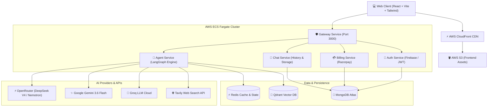

# ⚡ Zuno-AI — Next-Generation Multi-Agent AI Platform

<p align="center">
  
  
  
  
  
</p>

---

## 🌟 Overview

**Zuno-AI** is a cloud-native, enterprise-grade **Multi-Agent Artificial Intelligence Platform** built to seamlessly handle coding, presentations, document analysis, multimodal vision, real-time web search, and general reasoning.

Powered by **LangGraph**, **OpenRouter DeepSeek V4 Flash**, **Google Gemini 3.6 Flash**, and a high-performance **Docker microservices architecture**, Zuno-AI dynamically orchestrates specialized autonomous agents to deliver lightning-fast, high-precision results with live interactive previews.

---

## 🚀 Key Features

### 🧠 Autonomous Multi-Agent Routing (LangGraph)
* **Intelligent Auto-Router**: Automatically analyzes user intent and routes tasks to the optimal domain agent.
* **Multi-Tier Fault Tolerance**: Redundant fallback chain across OpenRouter (DeepSeek V4 Flash, Nemotron 3 Ultra), Google Gemini, and Groq engines with zero downtime.

### 💻 Interactive Code Studio & Artifacts
* **Multi-File Project Generation**: Generates complete, executable HTML/CSS/JS frontend projects.
* **Monaco Editor Integration**: In-browser code editing with syntax highlighting, multi-file tab switching, and direct ZIP export.
* **Live Sandbox Preview**: Instant iframe preview execution with hot reload and error boundary protection.

### 📊 Presentation Generator (PPTX)
* **Dynamic Multi-Slide Decks**: Generates professional, themed PowerPoint (`.pptx`) decks with 10+ distinct slide layouts.
* **Zero AI Image Token Consumption**: Automatic retrieval of high-resolution context-aware web and stock imagery via Tavily and Unsplash.
* **Native PPTXGenJS Engine**: Color tokens, typography hierarchy, and automatic text overflow protection.

### 📄 Smart PDF & Document RAG
* **Styled PDF Generation**: Creates publication-ready PDFs with clean typography, headers, callouts, and inline photos.
* **Vector Document Q&A (RAG)**: Upload documents for hybrid semantic search and retrieval powered by **Qdrant Vector Database**.

### 🔍 Real-Time Grounded Web Search
* **Tavily Search Grounding**: Fetches live real-time information with source attribution, conflict resolution, and fact ranking.
* **Time & Date Awareness**: Accurate live timestamps across global time zones.

### 👁️ Multimodal Vision & Image Analysis
* **Google Gemini 3.6 Flash Vision**: Deep visual comprehension for diagrams, charts, UI mockups, handwritten notes, and photos.

### 💳 Tiered Billing & Subscription Management
* **Razorpay Integration**: Automated payment processing, invoice tracking, webhooks, and subscription tiers (Free, Starter, Pro).

---

## 🏗️ Architecture & System Design



---

## 📂 Repository Structure

```
Zuno-AI/
├── .github/
│   └── workflows/
│       └── deploy.yml              # Automated AWS CI/CD Pipeline
├── backend/
│   ├── gateway/                    # API Gateway & Reverse Proxy (Port 3000)
│   ├── services/
│   │   ├── agent/                  # LangGraph Multi-Agent Engine (Port 3015)
│   │   │   ├── agents/             # Chat, Coding, PPT, PDF, PDF-RAG, Vision, Search
│   │   │   ├── config/             # Multi-Tier LLM Model Providers & Router
│   │   │   └── utils/              # PPTX, PDF, and Image Processing Engines
│   │   ├── auth/                   # Authentication & User Management (Port 3011)
│   │   ├── chat/                   # Conversation & Message History (Port 3012)
│   │   └── Billing/                # Razorpay Subscriptions & Webhooks (Port 3014)
│   └── shared/                     # Shared Redis, Database, & Utility Modules
├── frontend/                       # Modern React 19 + Vite Web Application
│   ├── src/
│   │   ├── components/             # Artifact Studio, Message Bubble, Chat, Sidebar
│   │   ├── context/                # Global Theme, Auth, and WebRTC Contexts
│   │   ├── redux/                  # Message & User Redux Slices
│   │   └── utils/                  # Live Code Execution & File Helpers
│   └── vite.config.js
└── deploy/
    └── aws/                        # ECS, ECR, S3, & CloudFront Deployment Scripts
```

---

## 🛠️ Technology Stack

| Layer | Technologies |
|---|---|
| **Frontend** | React 19, Vite, Tailwind CSS, Motion/React, Monaco Editor, Lucide Icons, JSZip, File-Saver |
| **Backend Framework** | Node.js (v22), Express.js, LangChain, LangGraph |
| **AI & LLM Engines** | OpenRouter (DeepSeek V4 Flash, Nemotron 3 Ultra), Google Gemini 3.6 Flash, Groq |
| **Databases & Vector** | MongoDB Atlas, Qdrant Vector Database, Redis (IORedis) |
| **Search & Media** | Tavily Search API, Puppeteer, PPTXGenJS, Canvas |
| **Auth & Payments** | Firebase Auth, JWT, Razorpay Payments API |
| **DevOps & Cloud** | Docker, AWS ECS Fargate, AWS ECR, AWS S3, AWS CloudFront, GitHub Actions |

---

## ⚙️ Environment Configuration

Create a `.env` file in the root and in respective microservice directories:

```env
# Server & Ports
PORT=3000
NODE_ENV=production
FRONTEND_URL=https://your-cloudfront-domain.cloudfront.net

# Databases
MONGO_URI=mongodb+srv://<username>:<password>@cluster.mongodb.net/zuno-ai
REDIS_URL=redis://:<password>@<redis-host>:6379
QDRANT_URL=https://<your-qdrant-cluster-url>.qdrant.tech
QDRANT_API_KEY=your_qdrant_api_key

# AI Provider API Keys
OPENROUTER_API_KEY=sk-or-v1-...
GEMINI_API_KEY=AIzaSy...
GROQ_API_KEY=gsk_...
TAVILY_API_KEY=tvly-...

# Authentication & Billing
JWT_SECRET=your_super_secret_jwt_key
FIREBASE_SERVICE_ACCOUNT={"type":"service_account",...}
RAZORPAY_KEY_ID=rzp_live_...
RAZORPAY_KEY_SECRET=your_razorpay_secret
```

---

## 🚀 Local Development Setup

### 1. Prerequisites
* **Node.js** (v20 or v22)
* **Docker Desktop** (Optional, for containerized local execution)
* **Git**

### 2. Clone the Repository
```bash
git clone https://github.com/aasif-45/Zuno-AI.git
cd Zuno-AI
```

### 3. Install & Start Backend Services
```bash
# Install root dependencies
npm install

# Start all microservices concurrently
npm run dev
```

### 4. Install & Start Frontend
```bash
cd frontend
npm install
npm run dev
```
Open **`http://localhost:5173`** in your browser.

---

## 🚢 Production Deployment

Zuno-AI is configured for continuous zero-downtime deployment to **AWS**:

1. **Automated CI/CD**:
   - Push to `main` triggers `.github/workflows/deploy.yml`.
   - Microservices are packaged as lightweight Linux Docker containers, tagged, and pushed to **AWS ECR**.
   - **AWS ECS (Fargate)** triggers a rolling zero-downtime update.
   - Frontend is built and synced to **AWS S3**, followed by a global **CloudFront CDN** invalidation.

2. **Manual CLI Deployment**:
   ```powershell
   # Sync Frontend directly to S3 and Invalidate CloudFront CDN
   aws s3 sync frontend/dist s3://myai-demo1/ --delete
   aws cloudfront create-invalidation --distribution-id ED6NUYKT6EJ1M --paths "/*"

   # Trigger ECS Task Update
   aws ecs update-service --cluster backend --service agent-service --force-new-deployment --region us-east-1
   ```

---

## 🛡️ Security & Privacy
* **End-to-End JWT Authentication** across all inter-service communication.
* **Isolated Code Execution**: Browser artifacts execute in sandboxed `about:srcdoc` iframes without direct cookie or session storage access.
* **Strict Attribute Stripping**: Markdown and math formulas are sanitized against prompt injections.

---

## 📄 License
This project is licensed under the **MIT License**.

---

<p align="center">
  <b>Built with ❤️ for the Next Generation of AI Experiences.</b>
</p>